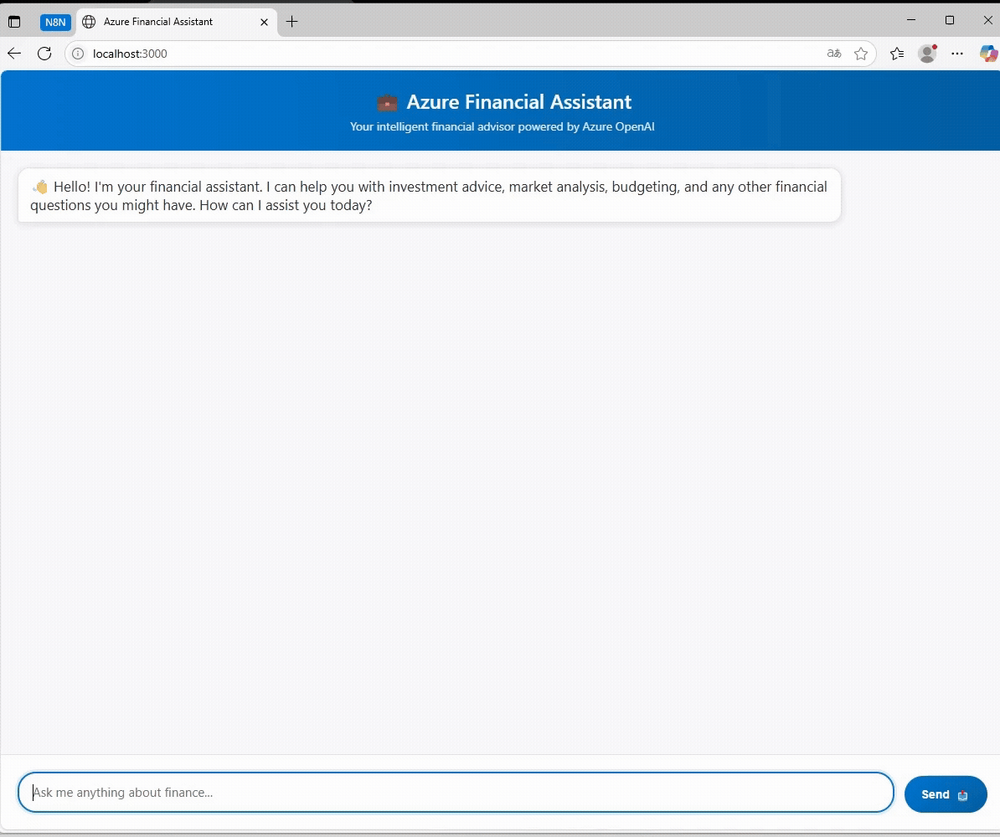

# 💰 FinanceGPT

A real-time streaming financial advisor chatbot powered by Azure OpenAI, featuring conversation memory and ChatGPT-like interface.

## ✨ Features

- **Real-time streaming responses** - See answers appear character by character
- **Conversation memory** - Maintains context throughout the chat session
- **Financial expertise** - Specialized AI assistant for financial advice and analysis
- **Modern UI** - Clean, responsive interface inspired by ChatGPT

## 🚀 Demo



*Demo scenario showing conversation memory in action*

## 🛠️ Setup

1. **Clone the repository**
   ```bash
   git clone https://github.com/yourusername/finance-gpt
   cd finance-gpt
   ```

2. **Install dependencies**
   ```bash
   npm install
   ```

3. **Configure environment variables**
   Create a `.env` file:
   ```env
   AZURE_OPENAI_ENDPOINT=your_endpoint
   AZURE_OPENAI_API_KEY=your_api_key
   AZURE_OPENAI_DEPLOYMENT=your_deployment
   AZURE_OPENAI_MODEL=your_model
   AZURE_OPENAI_VERSION=2024-02-15-preview
   PORT=3000
   ```

4. **Run the application**
   ```bash
   npm start
   ```

5. **Open your browser**
   Navigate to `http://localhost:3000`

## 🎯 Demo Scenario

To showcase the conversation memory feature, try this interaction:

Message 1:
💬 User: I want to save for a vacation in 6 months. What’s a safe option?

Message 2:
💬 User: Will the CD earn more than the savings account?

Note: The generation of the assistant’s response to the second message was intentionally stopped to demonstrate context retention.

## 🏗️ Tech Stack

- **Backend:** Node.js, Express.js, Azure OpenAI
- **Frontend:** Vanilla JavaScript, HTML5, CSS3
- **Features:** Server-Sent Events for streaming, conversation history management


*Built with ❤️ for better financial decision making*
